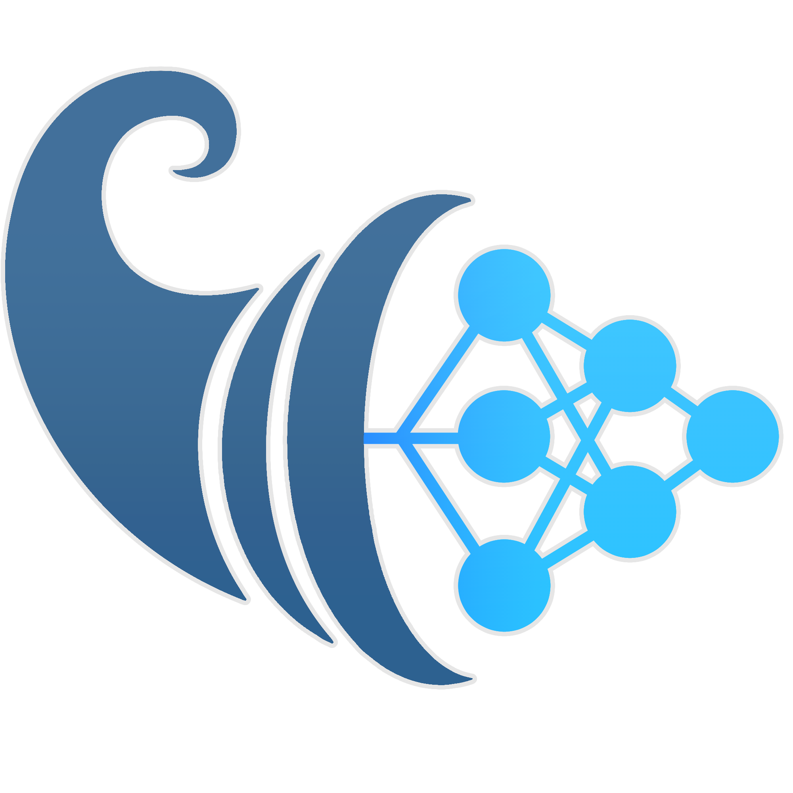

# AmalthAI Documentation Page

<p align="center">
    <a href="https://github.com/TEXTaiLES/AmalthAI" target="_blank">
        
    </a>
</p>

## Running the Documentation Locally

To run the **AmalthAI Documentation Page** locally, first create and activate the required Conda environment.

### 1. Create the Conda environment

```bash
conda create -n mkdocs python=3.12
```

Activate the environment:

```bash
conda activate mkdocs
```

Install the required version of `mkdocs-material`:

```bash
pip install mkdocs-material==9.6.20
```

### 2. Start the Documentation Server

Navigate to the directory containing the `mkdocs.yml` file:

```bash
cd path/to/documentation
```

Then start the MkDocs development server:

```bash
mkdocs serve
```

### 3. Access the Documentation

Once the server is running, the documentation page will be available at:

**http://localhost:8000**

Open the URL in your browser to access the **AmalthAI Documentation Page**.
