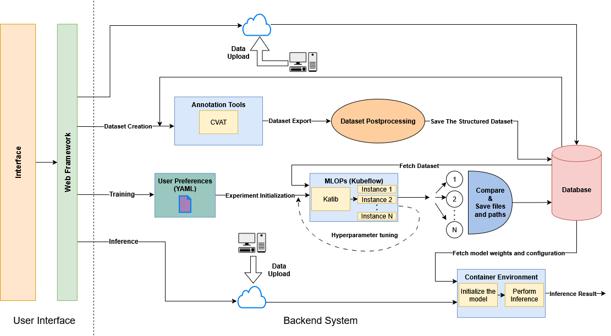
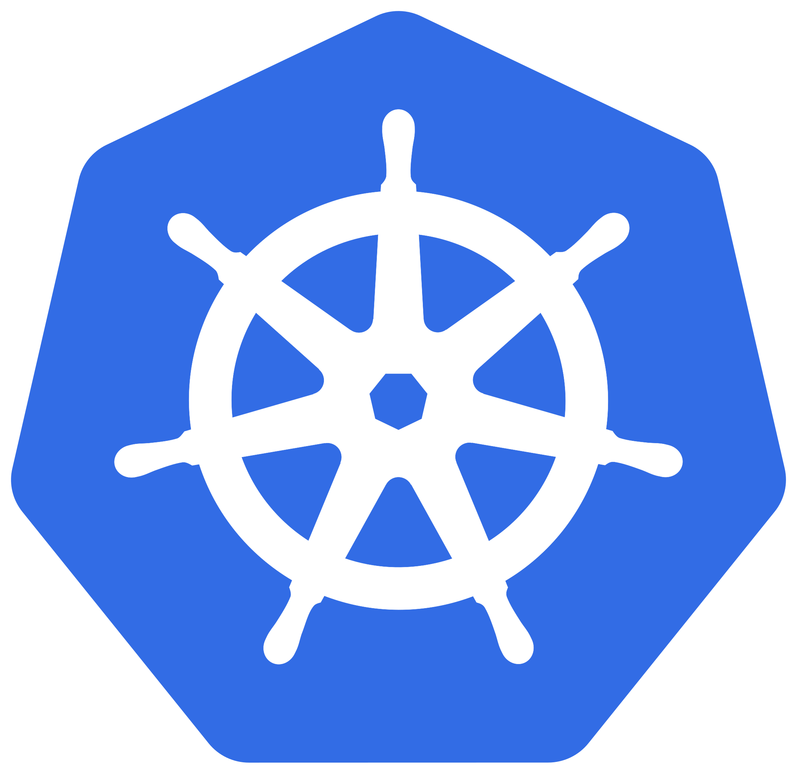
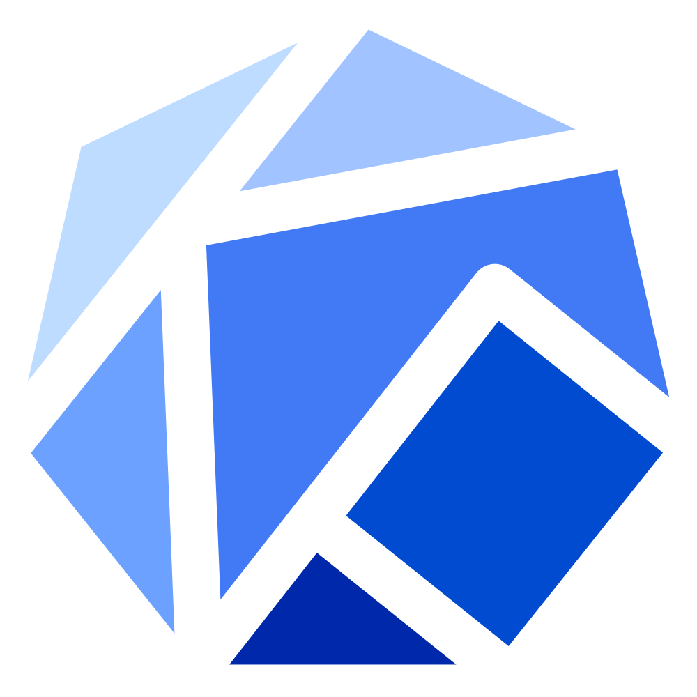

## Basic Installation

The whole platform architecture is depicted in the following diagram:
<p align="center">
  
</p>

Minimum system requirements for a local installation are:

 - CPU: at least 8 cores
 - RAM: at least 16 GB
 - GPU: NVIDIA GPU with at least 12 GB VRAM
 - OS: Ubuntu 22.04 or newer
 - Browser: Google Chrome or Microsoft Edge

### Before You Start
Make sure that you have cloned the following repository on your local machine:

```bash
git clone https://github.com/TEXTaiLES/AmalthAI
```
- The `AmalthAI_WebApp` folder contains the web app code, which is necessary for the platform's UI. 

- The `Backend` folder contains all the necessary code for the platform's functionality which includes machine learning models, data processing scripts, and deployment configurations.

### Step 1 - Docker Installation
Make sure that you have a local installation of [Docker](https://www.docker.com/). You can follow the installation process described [here](https://docs.docker.com/engine/install/ubuntu/):

<p align="center">
    <a href = "https://docs.docker.com/engine/install/ubuntu/" target="_blank">
        
    </a>
</p>

### Step 2 - kubectl and kind Installation
Instead of a full Kubernetes installation, this platform uses kind (Kubernetes in Docker) for local cluster management. For kubectl installation, follow the instructions [here](https://kubernetes.io/docs/tasks/tools/install-kubectl-linux/). For kind installation, follow the instructions [here](https://kind.sigs.k8s.io/docs/user/quick-start/#installation).

<p align="center">
    <a href = "https://kubernetes.io/docs/setup/" target="_blank">
        
    </a>
    <a href = "https://www.kubeflow.org/" target="_blank">
            
    </a>
</p>

### Step 3 - Cluster Setup and Katib Installation

**Create the kind cluster:**
```bash
kind create cluster --name=kubeflow --config=config.yml
docker exec -ti kubeflow-control-plane ln -s /sbin/ldconfig /sbin/ldconfig.real
```
The `config.yml` file can be found under the `Backend` folder.

**Install Helm:**
```bash
sudo snap install helm
```

Before you continue, make sure to install the NVIDIA toolkit on the local machine to establish connection with GPU resources.

**Install NVIDIA GPU Operator:**
```bash
helm repo add nvidia https://helm.ngc.nvidia.com/nvidia || true
helm repo update
helm install --wait --generate-name \
  -n gpu-operator --create-namespace \
  nvidia/gpu-operator --set driver.enabled=false
```

**Install Katib (standalone):**
```bash
kubectl apply -k "github.com/kubeflow/katib.git/manifests/v1beta1/installs/katib-standalone?ref=v0.17.0"
```

Also, ensure that the cluster:

 - has at least one directory shared between the cluster and the local machine (located inside the `config.yml` file under `extraMounts` as `containerPath` and `hostPath` respectively).

When the above directory is mounted, make sure that you move every folder from the `Backend` folder inside that directory so that the three tasks are accessible from the Katib pipelines.

### Step 4 - Docker Images Setup
Machine learning models require appropriate environments to run on. Because the platform is Kubernetes-based, there is need for ready-to-use docker containers. 

1) For the semantic segmentation and the classification mode, to run the models, a Docker container based on PyTorch is needed.

First of all, download the basic image using the followning command:

```bash
docker pull nvcr.io/nvidia/pytorch:22.12-py3
```

After pulling the base image, you have to create an updated image with all the necessary libraries installed. To do that, change your directory to `Backend/Segmentation/` and utilize the Dockerfile inside that folder by running the following command:

```bash
docker build -t segm_cls_image .
```

The Platform's backend dynamically creates containers on demand for each segmentation, classification and object detection task. These containers are single-use and they are instantiated only for the duration of the task execution and automatically destroyed upon completion.

2) For object detection task, you can use the official Ultralytics Docker image that has all the necessary libraries installed for running YOLO models.

To build this image locally, you can perform the following steps:

```bash
docker pull ultralytics/ultralytics:latest
```

<p align="center">
    <a href = "https://pytorch.org/" target="_blank">
        
    </a>
</p>

Important Note: Make sure that you keep the `config.yml` file updated inside `/AmalthAI_WebApp` folder with the correct image names and the shared directory path where the `Segmentation`, `Classification` and `ObjectDetection` folders are located.

### Step 5 - Upload docker images into kind cluster

To upload a locally built Docker image to your Kubernetes cluster, you have to run the following command:

```
kind load docker-image myimage:latest --name name-of-your-cluster
``` 

For the AmalthAI platform, you have to upload both the `segm_cls_image` and the `ultralytics/ultralytics:latest` images into the kind cluster.

### Step 6 - CVAT Installation
For the annotation purposes of this platform, we utilize [CVAT](https://www.cvat.ai/) annotation tool. To install it on your system, follow the instructions that are provided [here](https://docs.cvat.ai/docs/administration/basics/installation/).

<p align="center">
    <a href = "https://www.cvat.ai/" target="_blank">
        
    </a>
</p>

### Step 7 - Platform UI Setup
For the platform's UI, you have to create a Docker container with the appropriate libraries to run the web app.

1) First open your terminal inside the `/AmalthAI_WebApp` folder and run:

```shell
docker build -t amalthai .
```

2) After the build is completed, you can start the application with the following command:
```shell
docker compose up -d
```

Then you can easily navigate to the web app, by opening your browser and going to:
```
http://0.0.0.0:8056
```