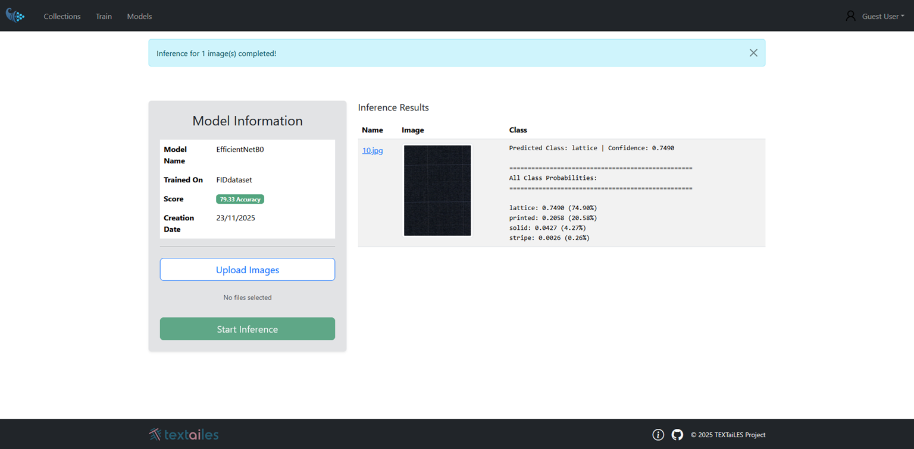

# Classification Mode
In classification mode, the model assigns a single label to an entire image, indicating the primary object or scene depicted. This allows the user to train the model to recognize and categorize images based on their content.

### Dataset Creation

To create a classification dataset, organize your images into separate folders, where each folder corresponds to a class label.

For example, if you are building a material classification dataset, you might create folders such as **wool**, **cotton**, and **silk**, and place the corresponding images inside each folder.

The dataset structure should look like this:

```
DatasetName/
│
├── wool/
│   ├── img1.jpg
│   ├── img2.jpg
│
├── cotton/
│   ├── img3.jpg
│   ├── img4.jpg
│
└── silk/
    ├── img5.jpg
    └── img6.jpg
```

If no train/validation split is provided, the platform will automatically split the dataset into **70% training** and **30% validation** samples.

### Providing a Pre-Split Dataset

If you prefer to define the training and validation sets yourself, organize the dataset using separate **train** and **val** directories:

```
DatasetName/
│
├── train/
│   ├── wool/
│   │   ├── img1.jpg
│   │   └── img2.jpg
│   │
│   ├── cotton/
│   │   ├── img3.jpg
│   │   └── img4.jpg
│   │
│   └── silk/
│       ├── img5.jpg
│       └── img6.jpg
│
└── val/
    ├── wool/
    │   ├── img7.jpg
    │   └── img8.jpg
    │
    ├── cotton/
    │   ├── img9.jpg
    │   └── img10.jpg
    │
    └── silk/
        ├── img11.jpg
        └── img12.jpg
```

### Annotation Process

Once your dataset is organized, you can compress it as .zip file and upload it to the platform. The platform will automatically recognize the folder structure and register the dataset accordingly.

When you complete the upload, the platform will display the dataset existance in the Collections page, showing the number of images it contains.

### Training Initiation
After completing the Dataset upload, you can initiate the training of your classification model. Follow these steps:

1. Navigate to the Train an ML model page.
2. Select the Classification mode.

There are two main fields that need to be filled:

- **Select Model**: Choose the model architecture you want to use for training.
- **Select Collection**: Provide a name for your model.

For the available models, you can find information about them by clicking on the Currently Available models arrow and click on the preferred model to see more details about its architecture.

### Inference Process
Once the model is trained, you can use it for inference on new images. To perform inference, follow these steps:

1. Navigate to the Inference page.
2. Select the trained semantic segmentation model from the list.
3. Upload the image you want to perform inference on.
4. Click the Run Inference button to see the segmentation results.

Once the Inference process is complete, the result will be displayed directly into the same page, showing the origin image along with the corresponding class and confidence score.

<p align="center">
  
</p>

### Evaluation Metric

`Accuracy` for classification is a metric that measures how well a model correctly assigns labels to input samples. It is computed by comparing the predicted class with the true class for each sample and counting how many predictions are correct. The final accuracy is obtained by dividing the number of correct predictions by the total number of samples. It provides a single overall score that reflects the proportion of correctly classified examples.