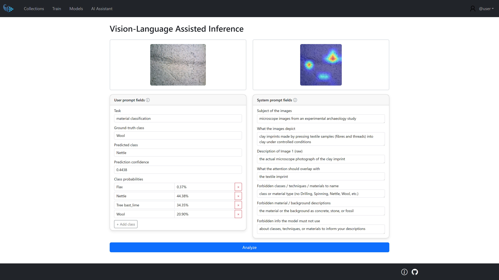

# Vision-Language Assisted Inference

In this mode, a Vision-Language Model is used to help interpret **misclassified samples**. Given the original image and its Grad-CAM visualization, the model produces a structured, natural-language explanation of why the classifier may have predicted the wrong class, grounded only in visible evidence.

<p align="center">
  
</p>

### Inputs

To generate an explanation, the VLM receives two images for the selected misclassified sample:

- **Image 1 (Raw)**: the original image, e.g. a microscope photograph of a clay imprint.
- **Image 2 (Grad-CAM)**: a heatmap overlay showing which regions of the image the classifier focused on when making its prediction.

Together with the images, the VLM receives two prompts: a **system prompt**, which is fixed and defines the assistant's role and output rules, and a **user prompt**, which carries the sample-specific classification results.

### System Prompt

The system prompt configures the VLM as a visual analysis assistant and constrains it to describing evidence rather than guessing labels. It acts as a fixed contract: it defines the assistant's role, constraints, and output schema, and prevents label knowledge from leaking into the visual description fields, which would otherwise make the explanation circular. It is built from a template with the following placeholders:

| Placeholder | Purpose | Example |
| --- | --- | --- |
| `blank1` | Domain of the images | microscope images from an experimental archaeology study |
| `blank2` | What the images depict | clay imprints made by pressing textile samples into clay |
| `blank3` | What Image 1 is | the actual microscope photograph of the clay imprint |
| `blank4` | What the Grad-CAM overlap is checked against | the textile imprint |
| `blank5` | What must not be named | class, technique, or material (e.g. Drilling, Wool) |
| `blank6` | What must not be described | the material or background as concrete, stone, or fossil |
| `blank7` | Prior knowledge that must not be used | knowledge about classes, techniques, or materials |

The system prompt enforces the following rules:

- **visible_description** must describe only what is visible in Image 1, with no mention of the heatmap.
- **attention_description** must describe *where* the heat in Image 2 is spatially located (center / edge / background / specific feature) and whether it overlaps the object of interest, without referring to colors.
- No class, technique, or material name may be used.
- The model must not judge whether the classifier was right or wrong.
- The model must not describe the material or background using assumed identities (e.g. concrete, stone, fossil).
- The model must not draw on outside knowledge of classes, techniques, or materials.
- The response must be returned as **strict JSON**, with 1–2 sentences per field:

```
{
  "visible_description": "",
  "attention_description": "",
  "task_properties": {
    "task": "",
    "ground_truth": "",
    "predicted_class": "",
    "confidence": "",
    "class_probabilities": {}
  }
}
```

### User Prompt

The user prompt supplies the concrete classification results for the sample being explained, so the VLM can reason about a specific misclassification instead of a generic image. It is sample-specific: it injects the actual ground truth, prediction, and confidence values needed for the explanation, without letting that information bias the visual description.

| Field | Meaning | Example |
| --- | --- | --- |
| `task` | Classification task | technique classification |
| `ground_truth` | Correct label | Drilling |
| `predicted_class` | Label predicted by the classifier | Splicing |
| `confidence` | Model confidence in the prediction | 0.3488 |
| `class_probabilities` | Full probability distribution over classes | Drilling: 31.39%, Spinning: 33.73%, Splicing: 34.88% |

The user prompt instructs the VLM to explain why the classifier may have predicted `predicted_class` instead of `ground_truth`, using only visible evidence from the raw image and the Grad-CAM. Class probabilities are provided as supporting information only, not as the basis of the explanation, and the response must follow the JSON schema defined in the system prompt.

The result is a structured output that pairs raw visual observation (`visible_description`) with attention-region reasoning (`attention_description`), grounded in the classifier's actual output (`task_properties`), giving domain experts an interpretable account of why a misclassification may have occurred.