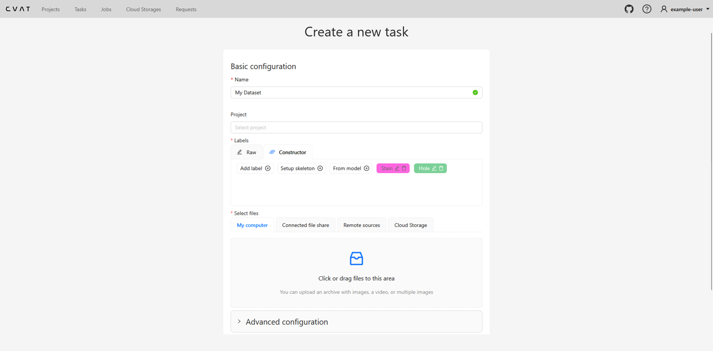
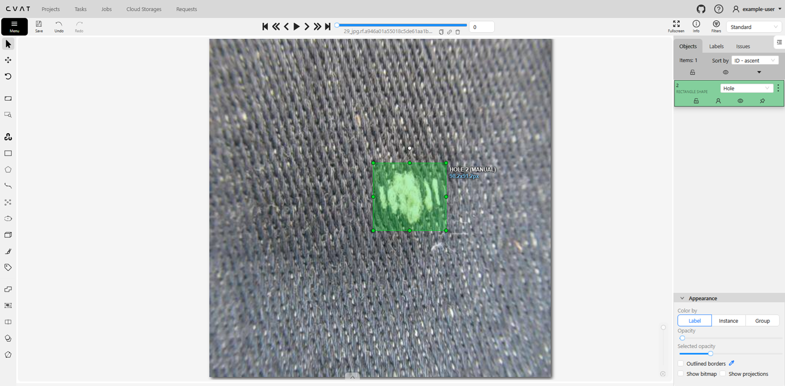
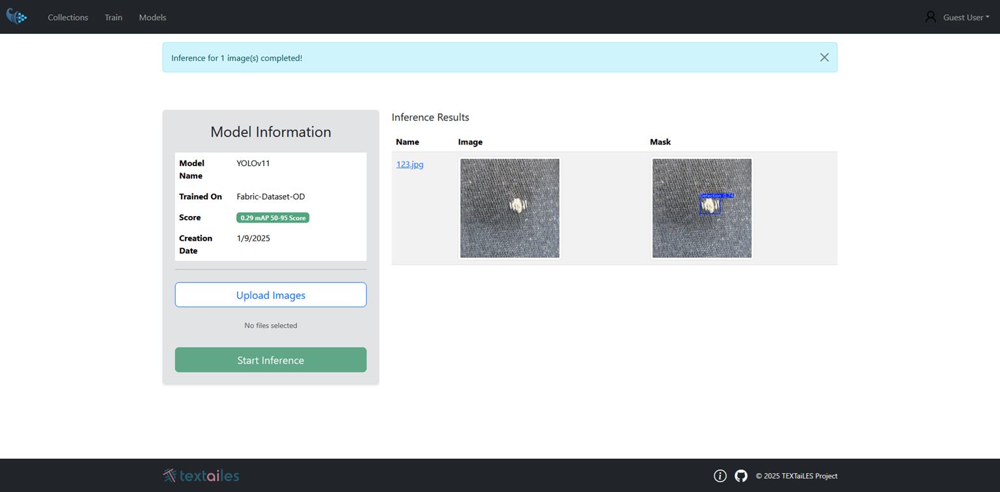

# Object Detection Mode
In object detection mode, the model identifies and locates objects within an image by drawing bounding boxes around them. This allows the user to train the model to recognize and classify multiple objects in a single image.

### Dataset Creation
To start creating a dataset for Object Detection, follow these steps:

1. Click the View Collections button on the Home page.
2. Click the Add a new Detection dataset button to create a new dataset.
3. Fill the appropriate information for your dataset, such as name, description and register your classes.
4. Upload images to the dataset by clicking on the Upload Images region.
5. Press Submit and Open Button to proceed with dataset annotation.

The dataset creation page will look like the following:

  

### Annotation Process
Once the dataset is created, you can start annotating the images. The annotation interface provides various tools to facilitate the annotation process:

- **Draw bounding box Tool**: Allows users to draw bounding boxes around objects of interest to assign them to a specific class.

  

**Important Note**: For Object Detection, the Draw bounding box Tool is the primary tool used for annotation.

Once you navigate through all images and complete the annotations, click the Menu button on the top left corner and change the job state to completed. Once this process is done, you will be able to see the dataset ready for training in the Collections page for the corresponding task type.

### Training Initiation
After completing the annotation process, you can initiate the training of your semantic segmentation model. Follow these steps:

1. Navigate to the Train an ML model page.
2. Select the Object Detection mode.

There are two main fields that need to be filled:

- **Select Model**: Choose the model architecture you want to use for training.
- **Select Collection**: Provide a name for your model.

For the available models, you can find information about them by clicking on the Currently Available models arrow and click on the preferred model to see more details about its architecture.

### Inference Process
Once the model is trained, you can use it for inference on new images. To perform inference, follow these steps:

1. Navigate to the Inference page.
2. Select the trained Object Detection model from the list.
3. Upload the image you want to perform inference on.
4. Click the Run Inference button to see the detection results.

Once the Inference process is complete, the detected objects will be displayed directly into the same page, showing the bounding boxes around the recognized objects.

  

