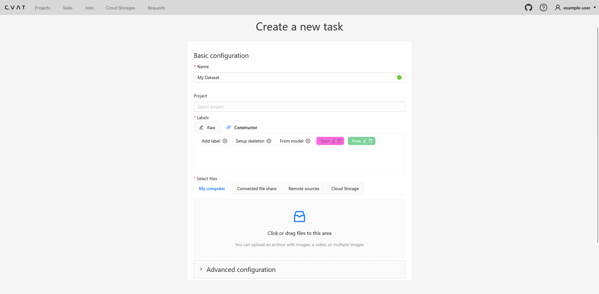
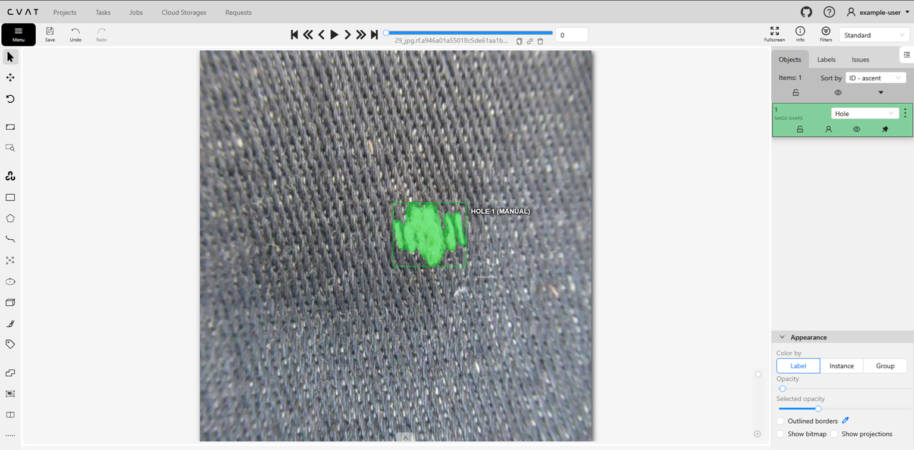
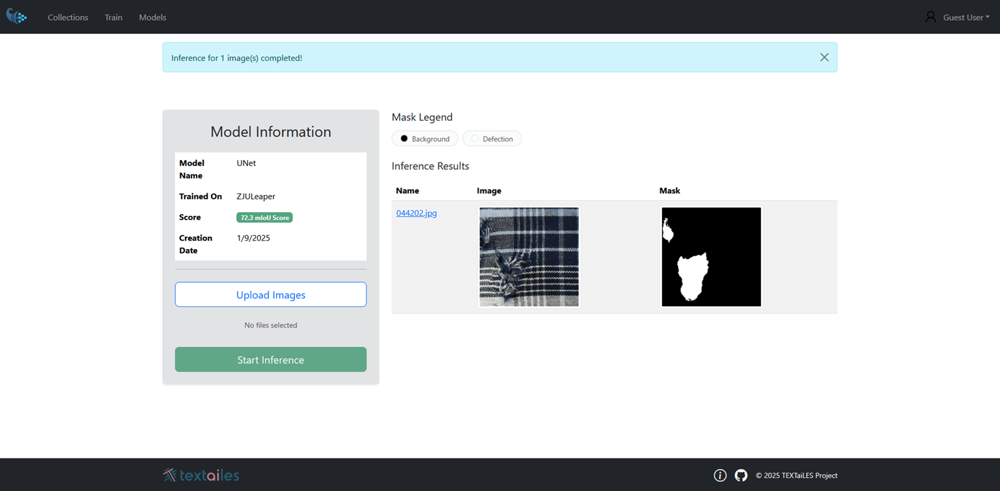

# Semantic Segmentation Mode
In semantic segmentation mode, the model classifies each pixel in an image into a predefined set of classes. By defining a set of classes during the dataset annotation process, the user can train the model to recognize and segment different regions of interest within an image.

### Dataset Creation
To start creating a dataset for semantic segmentation, follow these steps:

1. Click the View Collections button on the Home page.
2. Click the Add a new Segmentation dataset button to create a new dataset.
3. Fill the appropriate information for your dataset, such as name, description and register your classes.
4. Upload images to the dataset by clicking on the Upload Images region.
5. Press Submit and Open Button to proceed with dataset annotation.

The dataset creation page will look like the following:

<p align="center">
  
</p>

### Annotation Process
Once the dataset is created, you can start annotating the images. The annotation interface provides various tools to facilitate the annotation process:

- **Draw mask Tool**: Allows users to paint over regions of interest using a brush to assign them to a specific class.
- **Eraser Tool**: Enables users to remove parts of the mask that were incorrectly annotated.
- **Polygon/Rectangle Selection Tool**: Enables users to create precise masks by outlining the area of interest with polygons or rectangles.

<p align="center">
  
</p>


**Important Note**: For Semantic Segmentation, the Draw mask Tool is primarily used especially when dealing with complex shapes and regions.

### Dataset Registration
After completing the annotation process, you have to export the dataset using the **Segmentation Mask 1.1** export format from CVAT.

The generated segmentation masks can be found under the `SegmentationClass/` directory of the exported dataset.

Finally, the dataset should follow the structure below:
```
DatasetName/
├── images/
│   ├── train/
│   │   ├── image_001.jpg
│   │   ├── image_002.jpg
│   │   └── ...
│   └── val/
│       ├── image_101.jpg
│       ├── image_102.jpg
│       └── ...
├── masks/
│   ├── train/
│   │   ├── image_001.png
│   │   ├── image_002.png
│   │   └── ...
│   └── val/
│       ├── image_101.png
│       ├── image_102.png
│       └── ...
└── labelmap.txt
```
`labelmap.txt` defines the mapping between class IDs (colors) and class names. It is automatically exported from CVAT when using the Segmentation Mask 1.1 export format.

Once the dataset structure is finalized:

1. Compress the `DatasetName/` directory into a `.zip` archive.
2. Upload the generated `.zip` file to AmalthAI using the **Add a new segmentation dataset** button.

### Training Initiation
After dataset is uploaded, you can initiate the training of your semantic segmentation model. Follow these steps:

1. Navigate to the Train an ML model page.
2. Select the Semantic Segmentation mode.

There are two main fields that need to be filled:

- **Select Model**: Choose the model architecture you want to use for training.
- **Select Collection**: Provide a name for your model.

For the available models, you can find information about them by clicking on the Currently Available models arrow and click on the preferred model to see more details about its architecture.

### Inference Process
Once the model is trained, you can use it for inference on new images. To perform inference, follow these steps:

1. Navigate to the Inference page.
2. Select the trained semantic segmentation model from the list.
3. Upload the image you want to perform inference on.
4. Click the Run Inference button to see the segmentation results.

Once the Inference process is complete, the segmented image will be displayed directly into the same page, showing the different regions classified according to the predefined classes.

<p align="center">
  
</p>