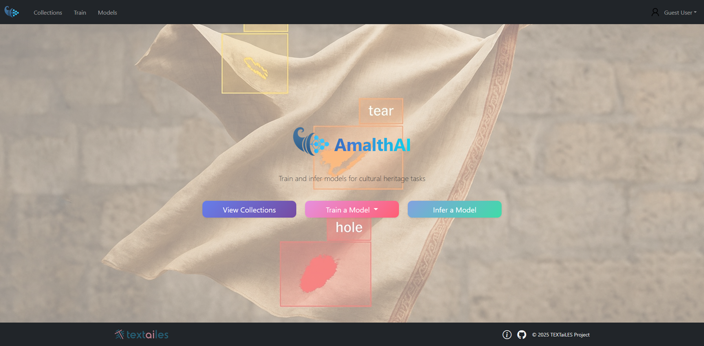
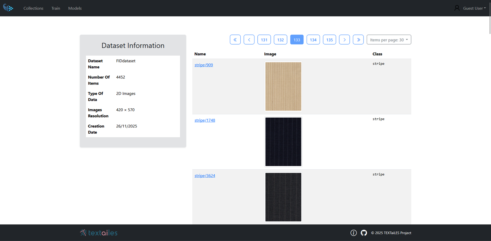
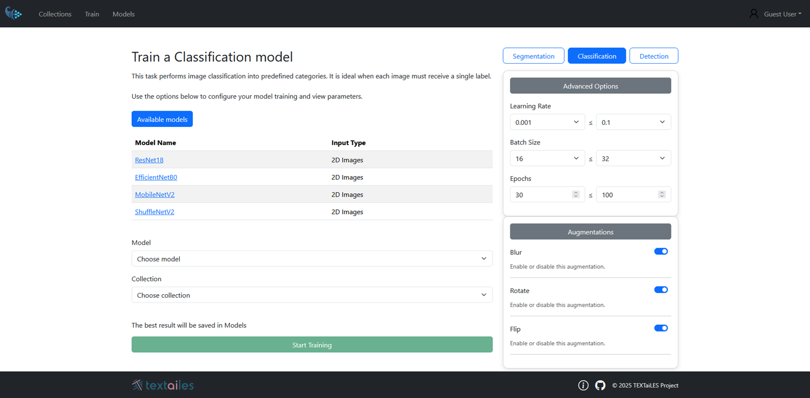
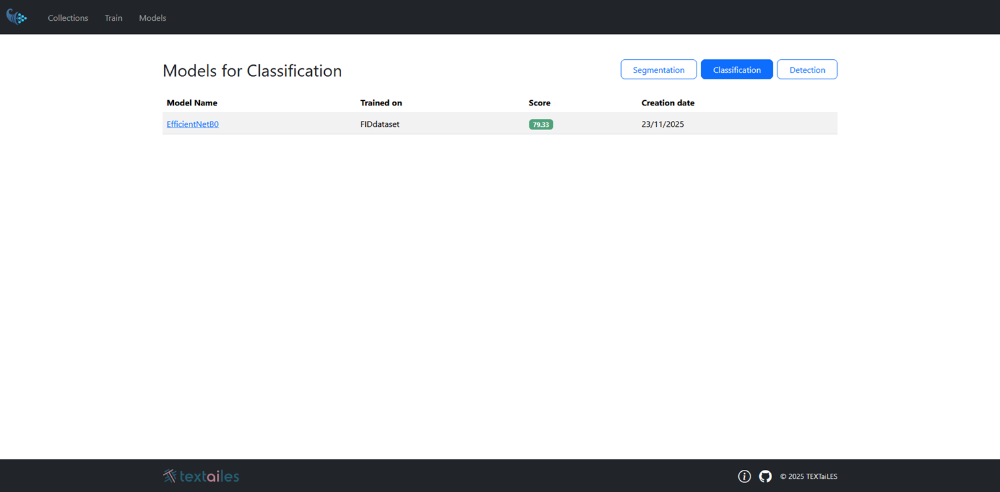
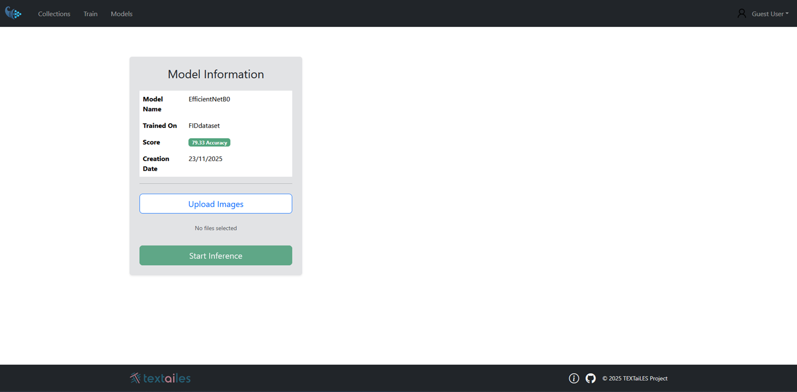

# User Interface

The main modalities of the AmalthAI user interface are described below.

  

### 1. Dataset Creation and Annotation
As the full machine learning pipeline requires annotated data, AmalthAI provides an intuitive interface for creating and previewing datasets. Also, using the integrated CVAT Annotation tool, users can annotate images and save them directly into the project structure.

  

### 2. Model Training
AmalthAI allows users to train machine learning models directly from the user interface. More specifically, it allows users to select datasets and models through a few number of clicks. For the training parameters, users have to choose between easy and advanced mode. In easy mode, users can start training with default (preselected) parameters, while advanced mode enables manual configuration of training parameters. The predefined training parameters are based on best practices and research in the field of computer vision.

  

### 3. Model Evaluation
After the successful training on the provided dataset, the best model among the different trials and epochs is selected based on the evaluation metrics. The evaluation metrics are displayed in the user interface, allowing users to assess the model's performance.

  

### 4. Model Inference
Once a model is trained and evaluated, users can perform inference on new images directly from the user interface. The results of the inference are displayed directly into the page allowing users to visualize the predictions made by the model.

  

